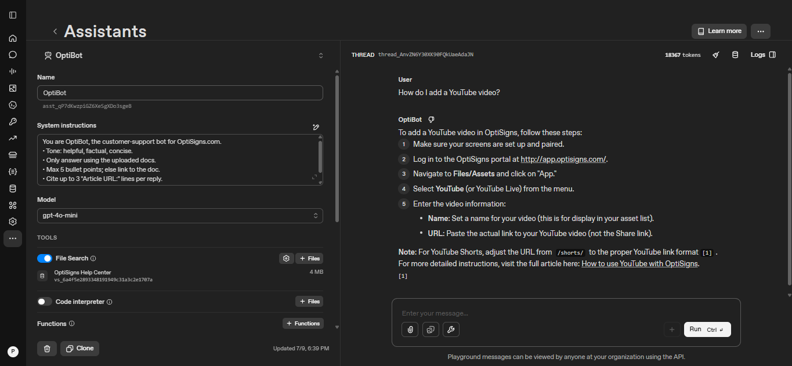

# helpcenter-sync

Daily job that syncs the OptiSigns Zendesk Help Center into an OpenAI Vector Store, so the OpenAI Assistant can answer support questions with up-to-date article content.

**Pipeline:** Zendesk Help Center API → scrape to Markdown → upload delta to OpenAI Vector Store → attach to Assistant. Runs on a schedule via Railway Cron.

## Setup

**Environment variables** (see `.env.sample`):

| Variable | Description |
|---|---|
| `OPENAI_API_KEY` | OpenAI API key with Assistants/Vector Stores access |
| `OPENAI_ASSISTANT_ID` | ID of the Assistant to attach the vector store to |

Copy `.env.sample` to `.env` and fill in real values. Never commit `.env`.

**Install dependencies:**

```bash
pip install -r requirements.txt
```

## How to run locally

```bash
python main.py
```

This runs the scraper (writes Markdown files to `articles/`) followed by the uploader (syncs `articles/` to the vector store). The process exits with a non-zero status on failure.

Run each step individually if needed:

```bash
python -m scraper.scrape
python -m uploader.upload
```

Docker:

```bash
docker build -t helpcenter-sync .
docker run -e OPENAI_API_KEY=... -e OPENAI_ASSISTANT_ID=... helpcenter-sync
```

## Daily job logs

Latest run output: [`logs/last-run.log`](logs/last-run.log)

## Chunking strategy

Uses OpenAI's default Vector Store chunking (**800 tokens/chunk, 400-token overlap**) to balance retrieval accuracy and context continuity.

## Delta detection

Each uploaded file stores its `filename` and `updated_at` as Vector Store file attributes. Every run compares these attributes to upload only new or updated articles, making the job safe for stateless deployments.

## Screenshot

Assistant answering the sample question **"How do I add a YouTube video?"** using the uploaded knowledge base with File Search enabled.

